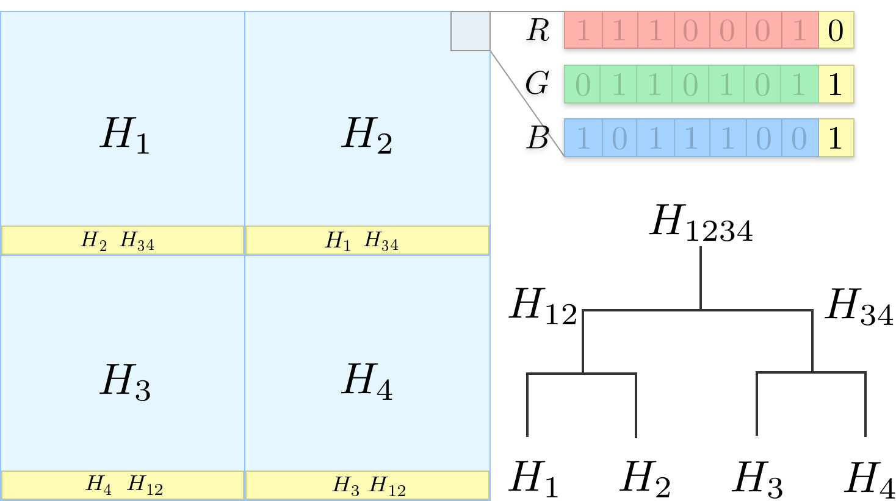

# image-stego

[](https://github.com/RichardLitt/standard-readme)

Steganography-based image integrity - Merkle tree nodes embedded into image chunks so that each chunk's integrity can be verified on its own. [Jump to the results](#results).

## Table of Contents

- [Background](#background)
- [Manipulation Detection](#manipulation-detection)
  - [Overview](#overview)
  - [Method](#method)
  - [Example](#example)
- [Results](#results)
  - [Original Image](#original-image) | [Encoded Image](#encoded-image) | [Chunking](#chunking)
  - [Manipulated Image](#manipulated-image) | [Detection](#detection)
- [Usage](#usage)
- [Reproduction](#reproduction)
  - [Encoding](#encoding)
  - [Decoding](#decoding)
- [Limitations](#limitations)
- [Second example](#second-example)
- [Timestamps](#timestamps)

## Background

Tamper-proof timestamping of digital content (like images) is based on generating a cryptographic hash of the file and persisting it in a blockchain (e.g., transferring money to a bitcoin address derived from that hash). The corresponding block of that transaction contains a timestamp that is practically impossible to alter. At a later point in time, a third party can prove the existence by hashing the data, deriving the bitcoin address, and verify the presence of that address in the blockchain without additional information. If the address is found, the third party can be sure that the data has not been manipulated after the block's corresponding timestamp.

Especially if the digital content is an image, there is the disadvantage of just needing to change one pixel (actually only one bit), and the resulting hash will be completely different. However, the original image will be perceptually identical. In most other use-cases (I'm aware of), this is a huge advantage though.

## Manipulation Detection

### Overview

While the following approach won't completely solve the problem mentioned above, it may be a step forward and may cause others' thoughts.

What is the approach about in one sentence:

> The method uses steganography to embed Merkle tree nodes into chunks of an image so that each chunk's integrity can be verified on its own.

In this context, [steganography](https://en.wikipedia.org/wiki/Steganography) means using the least significant bits (LSB) of the image to encode information. There are other techniques, but this was the most straight forward for me to implement.

By having individual chunks, one can still prove the integrity of parts of the image while seeing which areas have been tampered with.

### Method

As a first step, the image is divided into a set of chunks. These cannot be arbitrarily small though, because the smaller they are, the more data needs to be stored in each one but the less storage space each has. There's an optimum of in how many chunks the image should and can be divided into.

After the chunk count has been calculated, the first seven most significant bits of each chunk are hashed. This will result in a set of hashes that are now considered as Merkle tree leaves. Theses leaves are combined to derive the Merkle root hash. This hash can now be embedded into a blockchain.

Each chunk gets now the missing Merkle tree information encoded into its least significant bits so that it holds all information necessary to reconstruct the Merkle tree root hash.

### Example

Let's consider a squared image that is divided into four equal chunks. The algorithm examines each chunk separately by looping through all pixels and calculating the hash of the seven most significant bits of the 8-Bit RGB (and A) values of each pixel in the chunk. This will give the hash values , ,  and . In the picture below, the considered bits are printed faintly in the top right corner.



Those chunk hashes are now taken as Merkle tree leaves and used to construct the Merkle tree root hash like in the picture above in the bottom right.

The hash  should be the one to be persisted in a blockchain to be able to prove the existence.

For each chunk to be independently verifiable, those Merkle nodes are taken that are necessary to reconstruct the Merkle root and embedded in the least significant bits of the chunk (denoted in yellow above). The yellow bar at the bottom illustrates the set of least significant bits and data saved in them.

E.g. for hash  the hashes  and  are necessary to recalculate the Merkle tree root hash . The hash  doesn't need to be saved in the LSBs because it can and should be derived from the seven most significant bits of the image data itself.

Now the image is prepared so that each chunk holds enough information to verify its integrity independently. If an adversary were to manipulate parts of the image, the corresponding chunks would become invalidated (e.g., the root hashes wouldn't equal the others), and those chunks can be identified. Other chunks can still be proven to not having been manipulated, which wouldn't have been the case if just the whole image was hashed.

## Results

### Original Image

(w: 1038px, h: 435px)


### Encoded Image

Perceptually identical


### Chunking


### Manipulated Image

Can you spot the manipulation?


### Detection

Decoded image


## Usage

First you need to build the binary:

```shell
go build -o stego cmd/stego/main.go
```

and then run `./stego` to get the following usage description:

```text
Usage of ./stego:
  -d	Whether to decode the given image file(s)
  -e	Whether to encode the given image file(s)
  -o string
    	Output directory of an encoded image
```

## Reproduction

### Encoding

To reproduce the results build the tool as described above. Then take the example image and encode it by running:

```shell
./stego -e -o="out" data/porsche.jpg
```

Now you'll find the encoded image in the `./out/` folder along with an image that shows the chunks.

### Decoding

Run the following command to verify that the image has not been tampered with:

```shell
./stego -d out/porsche.png
```

You should see the following output:

```text
2020/09/16 19:05:44 ...
2020/09/16 19:05:44 This image has not been tampered with. All chunks have the same Merkle Root: 278cba1daf96d84165f8aa69d184e63df5c79f3a4c31cc6864e148c0317c713d
```

Manipulate the image and run the above command again (don't save the image as JPEG as the data in the LSBs wouldn't survive the compression):

```shell
./stego -d out/porsche.png
```

You should see the following output:

```text
...
2020/09/16 19:10:30 Found multiple Merkle Roots. This image has been tampered with! RootHashes:
2020/09/16 19:10:30 Count       Root
2020/09/16 19:10:30     1       1323d18f3aab27b4414535825b9b755c61b19fbd2ce7f2a39688e95e5f32fe15
...
2020/09/16 08:10:30   413       278cba1daf96d84165f8aa69d184e63df5c79f3a4c31cc6864e148c0317c713d
...
2020/09/16 08:10:30 Drawing overlay image of altered regions...
2020/09/16 08:10:30 Saving overlay image: out/porsche.overlay.png
```

## Limitations

There are several limitations that come to my mind I just want to list here:

- Only lossless image file formats are supported as the least significant bits wouldn't survive a jpeg compression. There are steganography approaches that address precisely this problem, though.
- The original image is altered.
- It's actually unnecessary to embed the Merkle tree information in the image itself but to save it separately (maybe header information or a separate file). However, having all verification information in one place has its advantages too.
- Cropping is not supported yet because there needs to be a mechanism to find the chunk dimensions independently of the image size.
- The `Chunk` struct implements the Gos `Writer` interface to encode data in the LSBs. This means only whole bytes can be written, which leads to wasted space for meta-information like 1. How many hashes are encoded in this chunk, 2. which side should this hash be appended/prepended to calculate the root hash? Especially the latter information is a simple boolean flag which wastes a whole byte.
- If an adversary knew about the encoding it is easy to invalidate it for the whole image

## Second example

You can find the second example [here](./examples/README.md).

## Timestamps

Commits:

- [`9b54dc5b4b912b0c3f5944c1bd7ac008b16beb6e`](https://originstamp.com/verify/#v/9b54dc5b4b912b0c3f5944c1bd7ac008b16beb6e)
- [`419b61e4a800ab33c3c2ef3adcf5d4441f3e7254`](https://originstamp.com/verify/#v/419b61e4a800ab33c3c2ef3adcf5d4441f3e7254)
