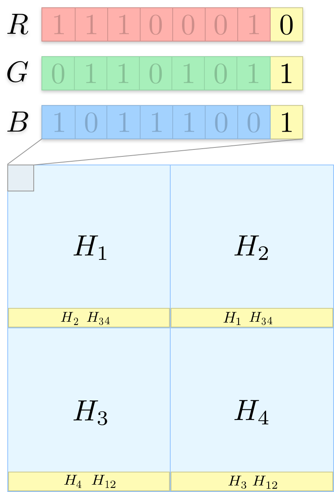
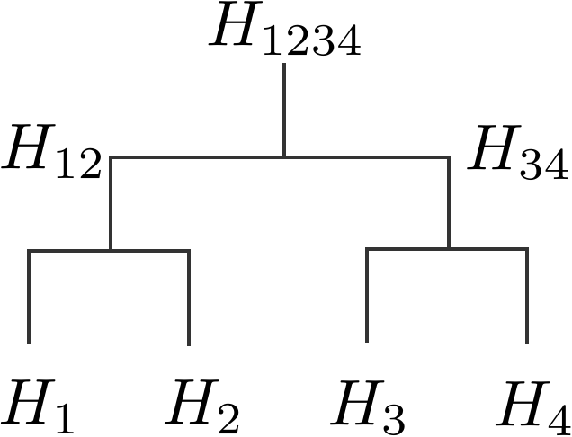

# image-stego

Steganography-based image integrity - verify the integrity of individual parts of an image without the need of secondary information.

## Motivation

Tamper-proof timestamping of digital content (like images) is based on generating a cryptographic hash of the file and persisting it in a blockchain (e.g. transferring money to a bitcoin address derived from that hash). The corresponding block of that transaction contains a timestamp that is practically impossible to alter. At a later point in time a third party can proof the existence by hashing the data, deriving the bitcoin address and verify him/herself the presence of that address in the blockchain. If the address is found the third party can be sure that the data has not been manipulated after the corresponding block timestamp.

Especially if the digital content is an image there is the disadvantage of just needing to change one pixel (actually just one bit) and the resulting hash will be completely different although the original image will be perceptually identical. For example one wouldn't be able to proof that a particular image was created earlier than claimed.

## One step forward

While the following approach won't solve the aforementioned problem it may be a step in the right direction and may cause thought for others.

What does the approach do in one sentence:

> It uses steganography to embed merkle tree nodes into chunks of the original image, so that each individual chunk can be verified on its own.

[Steganography](https://en.wikipedia.org/wiki/Steganography) in this context means using the least significant bits (LSB) of the image to encode information. There are other techniques but this was the most straight forward for me to implement.

By having individual chunks one can still proof the integrity of parts of the image while seeing which areas have been tampered with.

## The Approach

As a first step the image is divide in a set of chunks. However the chunks can not be arbitrarily small because the smaller the chunks are the more data needs to be stored in each one but the less storage space each has. There's an optimum of in how many chunks the image should be divided.

After the chunk count has been calculated the first seven most significant bits of each chunk are hashed. This will result in set of hashes that are now considered as merkle tree leafs. Theses leafs are combined to derive the merkle root hash. This hash can now be embedded into a blockchain.

## Example

Let's consider a squared image that we'll divide in four equal chunks. The algorithm examines each chunk separately by looping through all pixels and calculating the hash of the seven most significant bits of the 8-Bit RGB (and A) values of each pixel in the chunk. This will give the hash values , ,  and . In the picture below the considered bits are printed faint.

Having calculated the hash values we'll view them as merkle tree leafs and construct the merkle root hash like in the following picture:

The hash  should be the one to be persisted in a blockchain to be able to proof the existence.

For each chunk to be independently verifiable we'll take the merkle nodes that are necessary to reconstruct the merkle root again and embed them in the least significant bits of the image (denoted in yellow above). The yellow bar at the bottom should illustrate the set of least significant bits and data that's saved in them for each chunk.

E.g. for hash  the hashes  and  are missing to unambiguously recalculate the merkle root hash . The hash  doesn't need to be saved in the LSBs because it can be derived from the seven most significant bits of the image data itself.

Having prepared the image in such a way each chunk holds enough information to independently verify its integrity. If an adversery was to manipulate parts of the image the corresponding chunks would become invalidated (e.g. the root hashes wouldn't equal the others) and those chunks can be marked.

## The Results

Original image:

Encoded image:

Chunking of the original image:

Manipulated image:

Decoded image:

## Limitations

## Future Prospect

Timestamped commit: 9b54dc5b4b912b0c3f5944c1bd7ac008b16beb6e

---

I'm imagining an image scraper that looks through social media images and finds out that an image from a e.g. battlefield was actually taken from another battle in another country two years earlier than claimed in the post. The image scraper wouldn't have the original image and the adversary could just change one pixel to deceive the scraper, so it cannot verify the existence.

In reality this use case is exacerbated due to compression, cropping etc. of images.

---

There is a method of timestamping digital content (e.g. images) by hashing it and writing the resulting character sequence into a blockchain (e.g. transferring money to a bitcoin address derived from that hash). The moment the information is written to the blockchain it cannot be altered without changing every subsequent block - which is
technically possible but in reality unfeasible. Therefore, it is a tamper-proof way of claiming intellectual property or proofing existence of any digital content.

You won't be able to easily proof that a particular image was created at another date than claimed or that it belonged to someone without having the original image.
