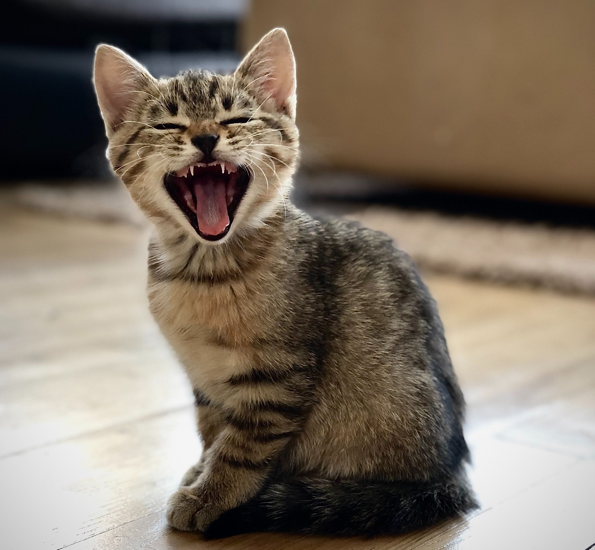
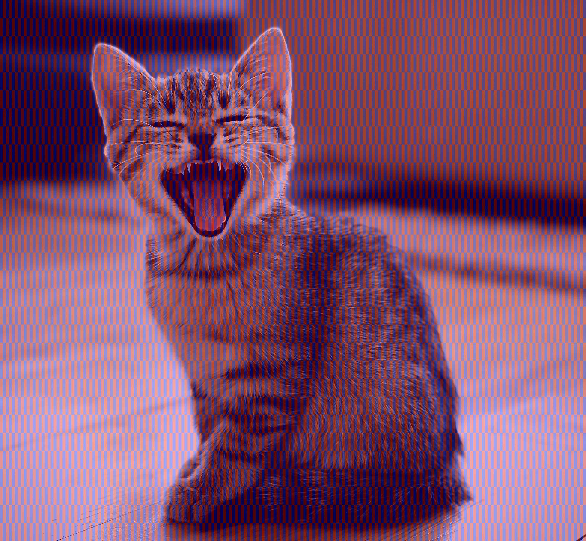
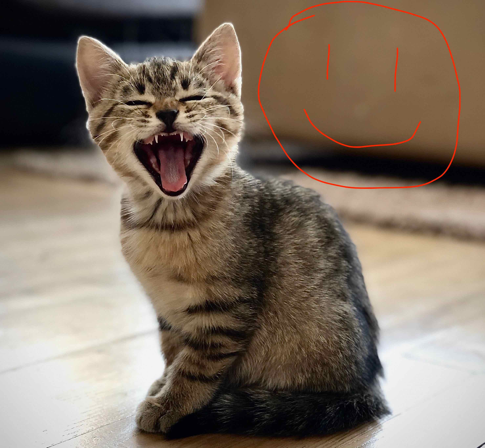
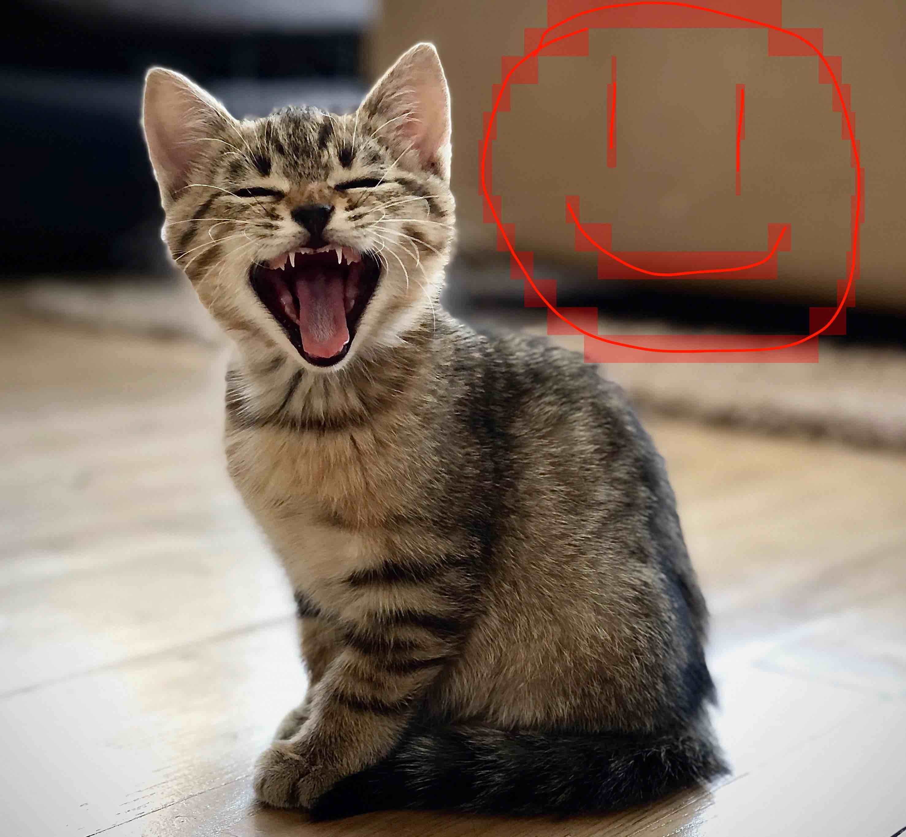

# Second example

This second example uses a larger image (2955 × 2731 pixels). 
This results in a quite large PNG image that I didn't want to commit to this repository. So the following images are
not the original ones that fell out of the encoding/decoding steps, but are JPEG-compressed. 
Perform the [Reproduction steps](../README.md#reproduction) by replacing `porsche` with `cat` and you will be able
to generate the corresponding images yourself:

Original image:

Encoded image: -> too large (~11.5 MB) and perceptually the same as above (in my opinion).

Chunking of the original image (JPEG-version):

Manipulated image (JPEG-version):

Decoded image (JPEG-version):

